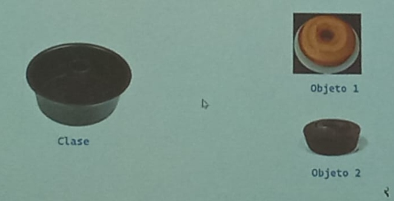

# 👍POO - PROGRAMACIÓN ORIENTADA A OBJEPTOS 
*La programacion orientada a objetos -`POO` o en sus siglas en ingles `OOP`, es una manera de programa **(paradigma)**, que permite llevar el codigo mecanismos usando con entidades de la vida real.*

**Sus beneficios son los siguientes:**

*1. **Encapsulamiento**: Permite `empaquetar` el codigo dentro de una entidad (objepto) donde se puede determinar el ambito de actuacion.*
   
*2. **Abstraccion**: Permite `generalizar` los tipos de objeptos a travez de las clases y simplificar el programa.*

*3. **Herencia**: Permite `reutilizar`codigo al poder heredar atributos y compartamientos de una clase.*

*4. **Polimorfismo**: Permitir`crear` multiples objeptos a partir de una misma pieza flexible de codigo.*
*existen 2 pilar más mas que a este nivel que estan alumnistos van a pujar.
existen dos que a nivel educativo no es nesesario aprenderlo:*

*5.  Acoplamiento*

*6.  Cohecion* 

## Que es un objeto
*Un 	`objeto` es un tip de dato estructurado que contine o almacena `datos` y `codigos`.*
_________________________________________________________
|Elementos|Que son | Como se llama|Como se identifica  |
|---------|--------|--------------|------------------- |
|Dato     |Variable|Atributos     |Mediante Sustantivos|
|codigo   |Función |Metodo        |Mediante Verbos     |

*Un objeto representa un`instancia unica`de alguna `entidad` a travez de sus atributos e interartua con otros objeto  o con si mismo a travez de sus metodos.*

## Que es una clase
Para crear un `objeto` primero debemos difinir la `clase`
para responder la pregunta Alex, debemos pensar en la`clase`como el `monte` con el que se crea nuevos objetos.

Es el proceso de diseño de una clase hay que tener en cuenta `el princcipio unica `esto intentando que los `atributos` y los `metodos` estan enfocados en un objetivo unico y bien difinido.

> [!TIP]
> *Un paridigma de programacion es un metodo, tecnica o estilo de programar, muchos de los lenguajes de programacion son creados en base de paradigmas, ejemplo java es un lenguaje que adopta el paradigma POO(programacion orientada a objetos). Sin en vargo existen lenguajes de programacion que adoptan varios paridigmas como es el caso de python y javacript estos son lenguajes multiparadigmas.*

